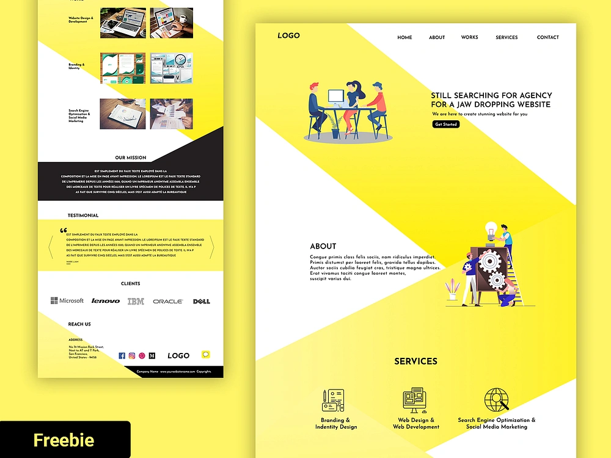

# 🌐 Agency Landing Page

This is a fully responsive landing page built using **HTML**, **CSS**, and **JavaScript**, developed as part of a frontend implementation exercise.  
**The goal was to recreate a given static layout image from scratch**, implementing modern best practices in responsive design and UI/UX development.

---
## 🔗 Live Preview

🌐 [View Live Site](https://ffmahani.github.io/Agency-website-project/)

---

## 🎨 Original Design Reference

🖼️ Below is the original static layout used as the reference for this project:  

 

The final result (as seen in the [Live Demo](https://ffmahani.github.io/Agency-website-project/)) closely mirrors the design — showcasing precision in spacing, typography, section structure, and responsiveness.

---

## 📌 About the Project

This project emulates a professional **agency-style landing page**, featuring structured, responsive, and interactive UI components:

- **Responsive Navigation Bar** with a burger menu for tablets and mobile
- **Hero Section** with a compelling call-to-action
- **Structured Sections**: About, Services, Works, Testimonials, and Clients
- **Testimonial Carousel** with auto-slide, arrow controls, and dot navigation
- **Clean Footer** with company information and clickable external links

---

## ✅ Features

- **Responsive layout** across mobile, tablet, and desktop screens  
- **Interactive burger menu** with smooth open/close transitions  
- **Auto-sliding testimonial carousel** with manual controls and pause-on-hover  
- **Smooth scrolling** for internal anchor links  
- **Clean modular file structure** with clear separation of concerns (HTML / CSS / JS)  

---

## 🛠️ Technologies Used

- **HTML5** — Semantic markup and accessibility
- **CSS3** — Responsive styling with refined media queries
- **Vanilla JavaScript** — DOM manipulation, animations, and interactivity

---

## 🗂️ Project Structure

```
images/
scripts/
├── menu.js                # Burger menu toggle
├── scrollBehavior.js      # Smooth scroll on Get Started
└── testimonial_carousel.js # Carousel logic
separate_section_styles/
├── header.css
├── banner.css
├── about.css
├── services.css
├── works.css
├── mission.css
├── testimonials.css
├── clients.css
└── footer.css
index.html
styles.css
README.md
LICENSE
```

---

## ▶️ How to Use

1. **Clone the repository:**

   ```bash
   git clone https://github.com/FFMahani/Agency-website-project.git
   ```

2. **Open `index.html` in your browser** to preview the landing page.

The code is clean and modular — feel free to extend or adapt it to your own projects.

---

## 👩‍💻 Author

**Fatemeh Fouladi Mahani**  
🎨 *Junior Frontend Developer passionate about clean design and creative user experiences.*
